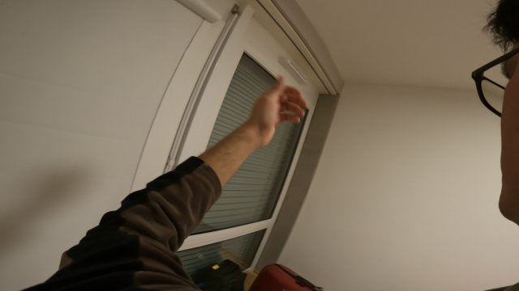
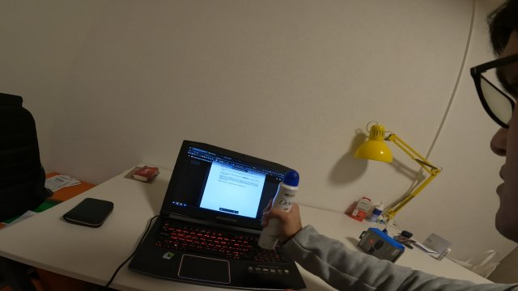
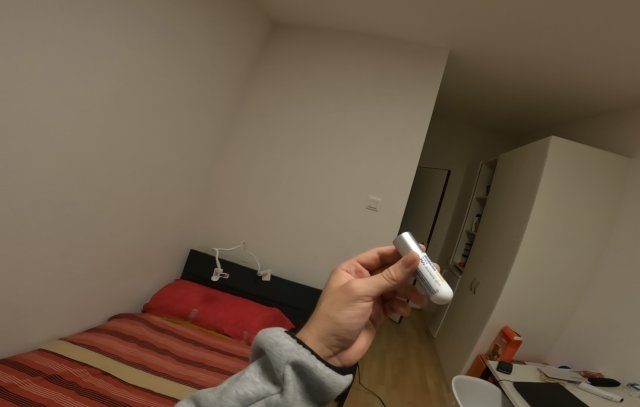

# Precision and Power Grip Detection in Egocentric Hand-Object Interaction

Code of the master's thesis *Precision and Power Grip Detection in Egocentric Hand-Object Interaction Using
Machine Learning* (Rodrigo Arian Huapaya Sierra, Master in Data Science, UPC-FIB; carried out at HEIG-VD and CHUV,
Switzerland). The full report is not versioned here (54 MB); a local copy can be kept at `docs/thesis.pdf`
(git-ignored). <!-- TODO: add the public link to the report (e.g. UPCommons) -->.

Given a frame recorded from the user's point of view, the system decides whether the hand is performing a
**power** grip, a **precision** grip, or **no** grasp. It is meant to support the evaluation of patients in upper
limb rehabilitation. The final model reaches an **F1-macro of 0.76** on the thesis test set.

| none | power | precision |
|:---:|:---:|:---:|
|  |  |  |

## How it works

Each frame is turned into 74 features by chaining four computer-vision models, and a small MLP classifies them
(thesis chapter 4):

```
frame ──► MediaPipe Hands ──► hand bounding box ───────────────┐
  │                                                            │
  ├──► YOLOv8 ──► object closest to / overlapping the hand ────┤
  │                                                            ├─► 74 features ──► MLP ──► none / power / precision
  ├──► MediaPipe Hands ──► 21 landmarks relative to the object ┤
  │                                                            │
  └──► MiDaS ──► depth(object) − depth(hand) ──────────────────┘
```

| Features | Count | Notes |
|---|---|---|
| Hand bounding box | 4 | min x, min y, width, height (MediaPipe) |
| Object bounding box | 4 | YOLOv8; if nothing is detected a *phantom* object is placed in the frame corner opposite to the hand |
| Landmarks | 63 | for each of the 21 landmarks: x and y distance to the object centre, and MediaPipe's z |
| Depth | 1 | median MiDaS depth in the object box minus median depth in the hand box |
| Handedness | 2 | one-hot left / right |

Pixel values are divided by the frame size and the depth difference by the largest absolute depth difference of the
training set (see `smartrehab.features`).

## Repository layout

```
configs/            dataset configs (ek, salsimu, yale) and training hyper-parameters
src/smartrehab/     the package
  hands.py            MediaPipe: hand bounding box + landmark features
  objects.py          YOLO: object selection
  depth.py            MiDaS .pfm depth maps -> depth difference
  features.py         74-feature layout, normalisation, dataset merging
  model.py            the MLP
  train.py            training loop
  evaluate.py         F1 scores, per-sample table, confusion matrices
  cli.py              command line interface
notebooks/          evaluation notebook
tests/              unit tests (synthetic data only)
docs/               sample images (and a local, git-ignored copy of the thesis PDF)
```

The iterations that led to this pipeline (simple CNN + Grad-CAM, MediaPipe + YOLO bounding boxes, landmarks, depth,
two hands, several resolutions; thesis sections 4.1–4.5) were originally kept as numbered folders `01`–`11` in
this repository. They are preserved in the git tag **`thesis-archive`**:

```bash
git show thesis-archive --stat                          # what is in the archive
git checkout thesis-archive -- 07.Adding_depth          # restore one folder into the working tree
```

## Setup

Python 3.9+.

```bash
python -m venv .venv
.venv\Scripts\activate            # Linux/macOS: source .venv/bin/activate
pip install -e ".[dev]"
pytest                            # unit tests, no data needed
```

`mediapipe` is pinned below 0.10.22 because the pipeline uses the legacy `mediapipe.solutions.hands` API.

Not included in the repository (you provide them):

* **Frames** of the datasets (see below).
* **YOLO weights**: `objects.weights` in the config (the thesis used `yolov8x6.pt`); Ultralytics downloads known weights on first use.
* **MiDaS depth maps**: run [MiDaS](https://github.com/isl-org/MiDaS) with the `dpt_beit_large_512` model on the frames
  and save the float outputs as `.pfm` (`<frame name>-dpt_beit_large_512.pfm`). The depth stage reads them from `depth.dir`.

## Datasets

| Config | Dataset | Frames | Notes |
|---|---|---|---|
| `configs/ek.yaml` | [EpicKitchens](https://epic-kitchens.github.io/), relabelled with MATLAB Video Labeler | 1920×1080 | class and hand are read from the directory path `<left\|right>/<power\|precision\|none>/`; several resolution variants (padded / cropped) are tried when MediaPipe misses the hand |
| `configs/salsimu.yaml` | Salad + Simulation, recorded with a chest-mounted GoPro at HEIG-VD / CHUV | 1920×1080 | class from the directory, hand from the file name |
| `configs/yale.yaml` | [Yale human grasping dataset](https://github.com/yalehumangrasping) | 640×480 | right hands only; frames and categories listed in a CSV |

All paths in the configs are relative to the directory you run the commands from; adapt them to where your data lives.

## Running the pipeline

Every dataset stage reads the CSV written by the previous one and writes to `outputs/<dataset>/` (change with
`--out`; add `--debug-images` to also save annotated frames):

```bash
smartrehab bbox      --config configs/ek.yaml      # -> outputs/ek/mp.csv          MediaPipe hand box
smartrehab yolo      --config configs/ek.yaml      # -> outputs/ek/mp_yolo.csv     + YOLO object box
smartrehab landmarks --config configs/ek.yaml      # -> outputs/ek/mp_yolo_lm.csv   + 21 landmarks (+ z)
smartrehab depth     --config configs/ek.yaml      # -> outputs/ek/results.csv      + MiDaS depth difference
```

(`python -m smartrehab ...` works as well.) Repeat for the other datasets, then merge, train and evaluate:

```bash
smartrehab combine outputs/ek/results.csv outputs/salsimu/results.csv outputs/yale/results.csv --output outputs/combined.csv
smartrehab train    --config configs/train.yaml                         # writes outputs/training/{models,runs,...}
smartrehab evaluate --checkpoint outputs/training/models/<model>.pth --data <test_results.csv>
```

The combined / test tables have the columns listed in `smartrehab.features.RESULT_COLUMNS`
(hand box, object box, `1x … 21z`, `depth_dist`, `handedness`, `picture_name`, `grasp`).
Which datasets are mixed for training is up to you; the thesis compared EpicKitchen alone, EpicKitchen + Yale and
EpicKitchen + Yale + Salad/Simulation (chapter 5). Training logs go to TensorBoard (`tensorboard --logdir outputs/training/runs`).

## Notes on this version

This repository was reorganised after the thesis. The pipeline logic and the model/training settings are those of
the thesis; the changes are structural, plus a few fixes to the surrounding code:

* The twelve near-identical per-dataset scripts are now one implementation driven by a YAML config per dataset.
* Fixed: checkpoint file names contained `:` (invalid on Windows); the Salad/Simulation scripts chained through a CSV name no step produced; the Yale scripts applied the EpicKitchen 420 px pad/crop offset to 640×480 frames (offsets are now derived from the frame size); a landmark debug image could read a row that had been skipped; YOLO results are read from memory instead of from `runs/detect/predictN` label files; output directories are created automatically; the device is configurable.
* Salad/Simulation hand selection: the old code did not filter detected hands by handedness when computing the box; it now uses the hand whose handedness is in the file name, like the other datasets.
* The normalised confusion matrix is now normalised per row (true class). The thesis code divided by the row sums along the wrong axis, which only affects that figure, not any metric.
* Checkpoints now also store the depth scale (`depth_max`) of the training set, used by `evaluate`. Old checkpoints without it fall back to the evaluated set's own maximum, as in the thesis.

### Known limitations (kept to stay faithful to the thesis results)

* The per-epoch validation loss is computed on the last validation sample only (accuracy uses all samples).
* The saved checkpoint holds the last-epoch weights; the reported metrics use the best-epoch weights.
* The best epoch is chosen on the same split that is reported (there is a separate test set only in the thesis experiments).
* The object "IoU" is an intersection area in pixels with a 5000 px threshold (`objects.MIN_OVERLAP`).
* Seeds are set now (`seed` in `configs/train.yaml`), but results will still differ slightly from the thesis runs, which were unseeded.
